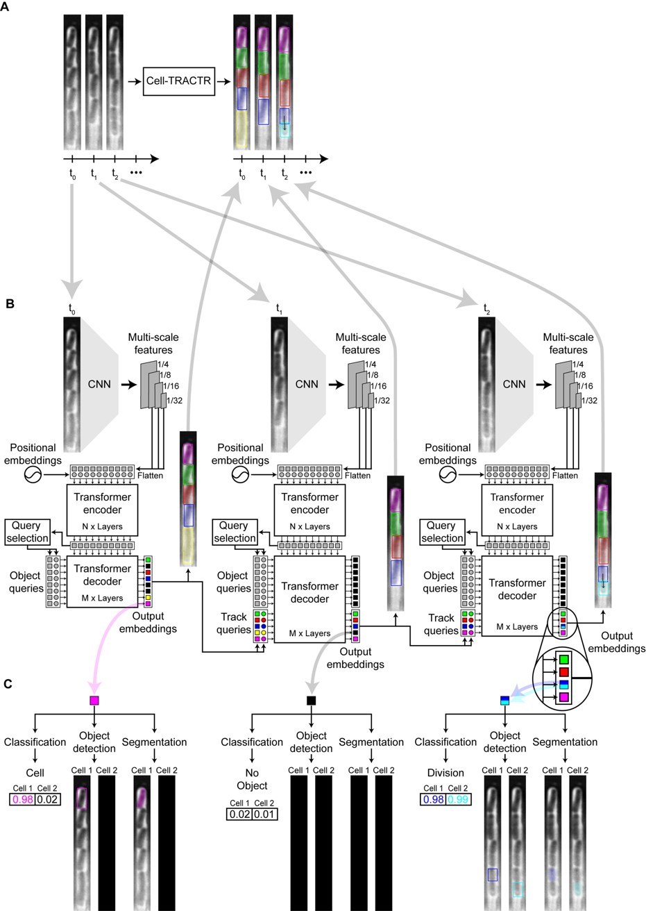
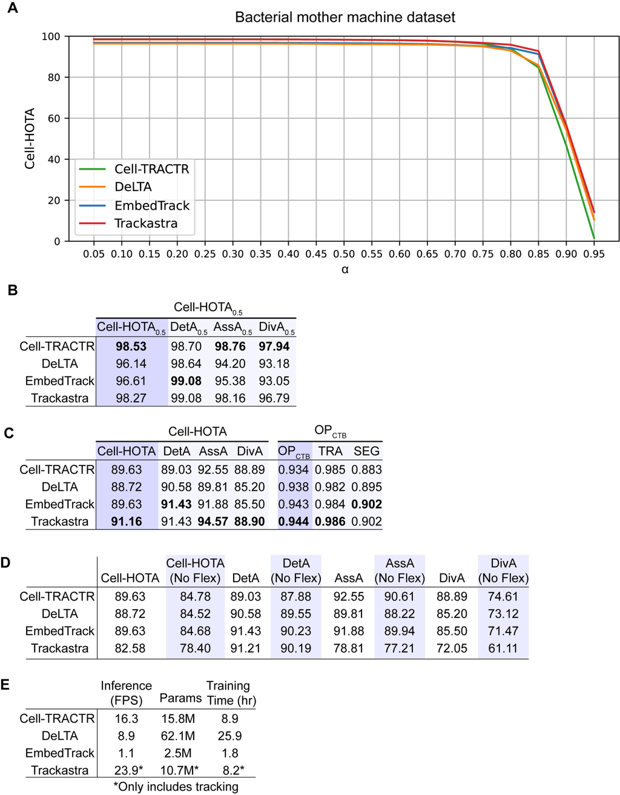

[](https://journals.plos.org/ploscompbiol/article?id=10.1371/journal.pcbi.1013071)
[](LICENSE)
[](https://www.python.org/downloads/release/python-3100/)
[](https://pytorch.org/)

# Cell-TRACTR
This repository provides the implementation of [Cell-TRACTR](https://journals.plos.org/ploscompbiol/article?id=10.1371/journal.pcbi.1013071) paper by Owen M. O'Connor and Mary J. Dunlop. The codebase builds upon [DETR](https://github.com/facebookresearch/detr), [Deformable DETR](https://github.com/fundamentalvision/Deformable-DETR) and [Trackformer](https://github.com/timmeinhardt/trackformer)

## Table of Contents
- [Abstract](#abstract)
- [Features](#features)
- [Installation](#installation)
- [Formatting Datasets](#formatting-datasets)
- [Weights](#weights)
- [Training](#train-cell-tractr)
- [Inference](#running-inference-for-cell-tractr)
- [Visual Examples](#visual)
- [Citation](#citation)
- [License](#license)

## Abstract
Cell-TRACTR (Cell TRacking with Attention and TRansformers) is a state-of-the-art deep learning framework designed for robust cell tracking in time-lapse microscopy. By leveraging the power of transformer architectures and attention mechanisms, Cell-TRACTR excels at tracking both bacterial cells in microfluidic devices and mammalian cells in standard culture conditions. The model demonstrates exceptional performance in handling challenging scenarios such as cell division events, density variations, and diverse morphologies. Cell-TRACTR achieves this through an end-to-end architecture that simultaneously performs detection, segmentation, and tracking, eliminating the need for separate pre-processing steps or post-processing heuristics.

### Cell-TRACTR Architecture for cell tracking


*Figure 1: The Cell-TRACTR architecture combines a CNN backbone with transformer modules for simultaneous detection, segmentation, and tracking of cells in microscopy videos.*

## Features
- 🔬 End-to-end cell tracking in microscopy videos
- 🧬 Support for both bacterial and mammalian cell tracking
- 🔄 Robust handling of cell division events
- 🎯 Simultaneous detection, segmentation, and tracking
- 📊 High accuracy across varying cell densities
- 🚀 GPU-accelerated inference
- 📈 Extensive evaluation on standard benchmarks

## Installation

Since Cell-TRACTR uses the MultiScaleDeformableAttention package, a GPU is required to train or run inference.

### Prerequisites
- NVIDIA GPU with CUDA support
- Python 3.10
- Git
- Conda package manager

### Step-by-step Installation

1. Clone and enter this repository:
```bash
git clone https://gitlab.com/dunloplab/Cell-TRACTR.git
cd Cell-TRACTR
```

2. Create and activate conda environment:
```bash
conda create -n cell-tractr python=3.10
conda activate cell-tractr
```

3. Install required packages:
```bash
pip3 install -r requirements.txt
```

4. Install FFmpeg:
```bash
conda install -c conda-forge ffmpeg
```

5. Install PyTorch 1.13.1 and CUDA 11.6:
Visit [PyTorch Previous Versions](https://pytorch.org/get-started/previous-versions/#v1131) to get the correct installation command for your system. You may choose other compatible versions of PyTorch.

6. Install pycocotools with fixed ignore flag:
```bash
pip3 install -U 'git+https://github.com/timmeinhardt/cocoapi.git#subdirectory=PythonAPI'
```

7. Install MultiScaleDeformableAttention package:
```bash
pip install -e src/trackformer/models/ops
```

### Common Issues and Solutions

1. **CUDA/GPU Issues**
   - Ensure your NVIDIA drivers are up to date
   - Verify CUDA installation with `nvidia-smi`
   - Check PyTorch GPU support with `torch.cuda.is_available()`

2. **MultiScaleDeformableAttention Installation**
   - If compilation fails, ensure you have the correct CUDA toolkit version
   - On Windows, you may need Microsoft Visual C++ Build Tools
   - For detailed troubleshooting, refer to [Deformable DETR](https://github.com/fundamentalvision/Deformable-DETR)

3. **Environment Conflicts**
   - Always start with a fresh conda environment
   - If you encounter conflicts, try installing packages in the order listed above
   - Use `conda list` to verify package versions

### Verification

To verify your installation:
```python
python -c "import torch; print(f'PyTorch version: {torch.__version__}'); print(f'CUDA available: {torch.cuda.is_available()}')"
```

## Formatting Datasets

Cell-TRACTR supports multiple dataset formats and provides tools for converting them to the required format. Below are the supported datasets and formatting instructions.

### Pre-formatted Datasets

1. **Mother Machine Dataset**
   - Available on [Zenodo](https://zenodo.org/records/11237127)
   - Contains bacterial cell tracking data in microfluidic devices
   - Pre-formatted in CTC format

2. **DeepCell Dataset**
   - Dataset: [DynamicNuclearNet-tracking-v1_0](https://datasets.deepcell.org/)
   - Contains mammalian cell tracking data
   - Requires conversion to CTC format before use

### Custom Dataset Formatting

You can use your own custom dataset by following the Cell Tracking Challenge (CTC) format specifications. For detailed formatting guidelines, refer to the [CTC documentation](https://public.celltrackingchallenge.net/documents/Naming%20and%20file%20content%20conventions.pdf).

#### Directory Structure
Your dataset should follow this structure:
```
data/
└── your_dataset/
    └── CTC/
        ├── train/
        ├── val/
        └── test/  (optional)
```

#### Converting to COCO Format

After organizing your data in CTC format, use the conversion script to prepare it for Cell-TRACTR:

```bash
python create_coco_dataset_from_CTC.py --dataset your_dataset
```

This will create a COCO-formatted version with the following structure:
```
data/
└── your_dataset/
    └── COCO/
        ├── annotations/
        ├── man_track/
        ├── train/
        └── val/
```

#### Important Notes
- Videos must have a minimum number of frames to be included in the training set
- The conversion script automatically handles frame sequence validation
- Both training and validation sets are required for training
- Test set is optional and used only for inference

## Weights

The weights to both pretrained models are availabe on [zenodo](https://zenodo.org/records/14509424).

## Train Cell-TRACTR

Cell-TRACTR training requires dataset-specific configurations through the `train.py` script in the `src` directory.

### Training Configuration

```bash
python src/train.py with dataset='your_dataset'
```

- Each dataset requires its own configuration file (e.g., `train_moma.yaml`, `train_DynamicNuclearNet-tracking-v1_0.yaml`)
- Important parameters to configure per dataset:
  - Number of queries
  - Target size
  - Learning rate
  - Batch size
  - Number of epochs
  - Model architecture settings

### Training Tips

- Monitor GPU memory usage during training
- Use `nvidia-smi` to track GPU utilization
- Adjust batch size based on available GPU memory
- Consider using gradient accumulation for larger effective batch sizes
- The script automatically resumes from checkpoints if available

## Running Inference for Cell-TRACTR

The inference pipeline requires dataset-specific configuration:

```bash
python src/pipeline.py with dataset='your_dataset'
```

- Uses dataset-specific configuration file
- Requires the same parameter settings used during training
- Processes test data from your dataset's test folder

### Important Notes
- Ensure your dataset follows the CTC format
- GPU is required for inference
- Monitor system resources during processing
- Results are saved in the dataset's output directory

## Visual Examples

### Performance Analysis


*Figure 4: Quantitative analysis using Cell-HOTA and Cell Tracking Challenge (CTC) metrics to evaluate Cell-TRACTR's performance across different experimental conditions and cell types. Cell-HOTA provides a comprehensive assessment of detection, segmentation, and tracking accuracy, while CTC metrics enable direct comparison with other methods.*

### Live Cell Tracking Examples

A time-lapse microscopy video of bacteria growing in the mother machine analyzed by Cell-TRACTR. The raw images used to generate this movie was taken from the test set within the [mother machine dataset](https://zenodo.org/records/11237127)

![[Video]](https://media0.giphy.com/media/v1.Y2lkPTc5MGI3NjExd2VrOW16djJnYzJ4cWhsd2F0cjNtNzVnazgzNjZuMjhucmdoNGkwYiZlcD12MV9pbnRlcm5hbF9naWZfYnlfaWQmY3Q9Zw/cwNDVhxqTPYMYMxd75/giphy.gif)

A time-lapse microscopy video of mammalian cells growing on 96-well plates. The raw images used to generate this movie was taken from the test set within the DeepCell dataset - [DynamicNuclearNet Tracking](https://datasets.deepcell.org/data)


## Citation
If you find this work useful in your research, please consider citing:

```bibtex
@article{oconnor2025cell,
  title={Cell-TRACTR: A transformer-based model for end-to-end segmentation and tracking of cells},
  author={O'Connor, Owen M. and Dunlop, Mary J.},
  journal={PLOS Computational Biology},
  year={2025},
  publisher={Public Library of Science},
  doi={10.1371/journal.pcbi.1013071}
}
```

## License

Cell-TRACTR is released under the [Apache 2.0 License](LICENSE).
